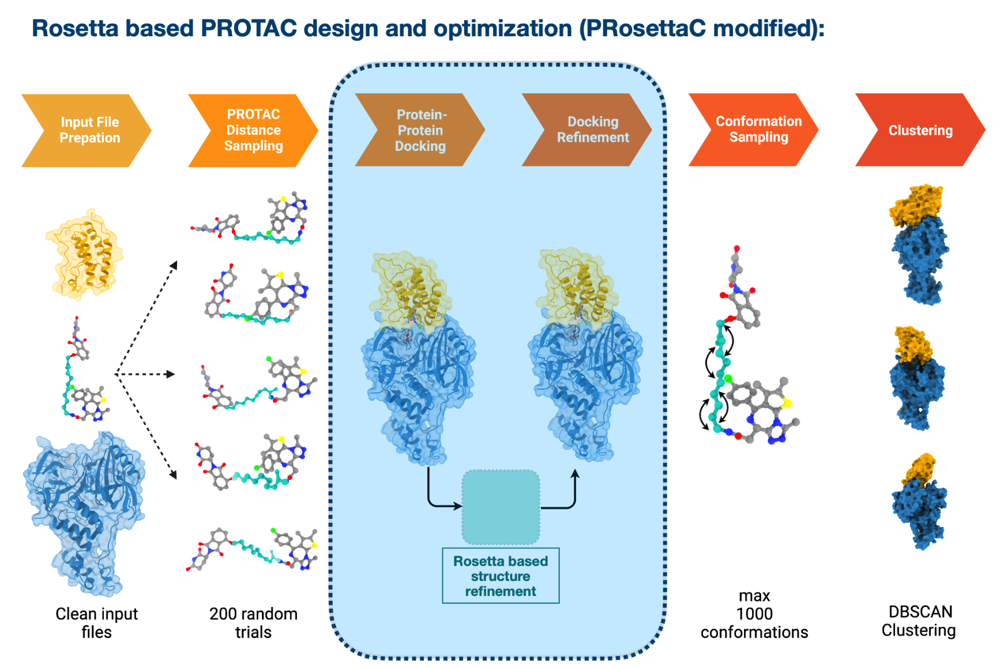
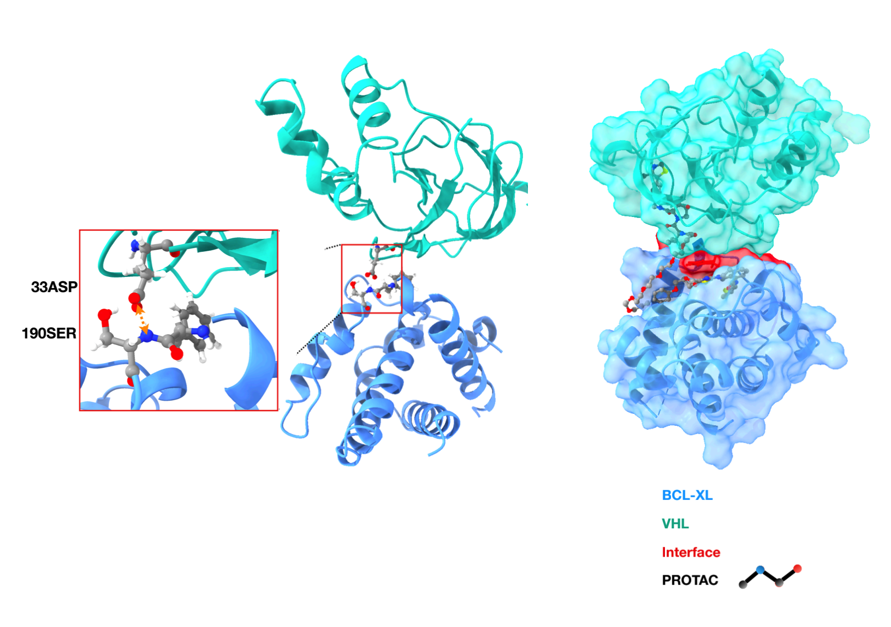

# Enrichment_Factor

This repository contains the script needed to filter PROTAC-ternary structures to improve Enrichment Factor of the complex. 

## Overview

We are provided with the resources and tools developed to address the challenge of targeted degradation of the human protein Bcl-xL. Bcl-xL plays a pivotal role as an anti-apoptotic protein, essential for the survival of cancer cells. Achieving its degradation involves creating a proximity between Bcl-xL and an E3 ligase enzyme (E3), triggering poly-ubiquitylation and subsequent recognition by the proteasome for degradation. Two primary methodologies are explored: PROTACs (Proteolysis-targeting chimeras) and molecular glues. PROTACs are formed by linking a POI ligand (warhead), an E3 ligand (anchor), and a linker fragment. In contrast, molecular glues are smaller and have better ADME properties, facilitating the E3::POI interaction.

## Workflow: Enhancing VHL::PROTAC::Bcl-xL Structural Model Accuracy

The initial task focuses on refining the structural models of the VHL::PROTAC::Bcl-xL system, using PDB 6ZHC as a reference for the ternary complex. The repository includes a dataset of 577 ternary complex models (6ZHC_ternary_designs.zip), each represented by two files: a protein complex file (x_y_PPI.pdb) and a corresponding PROTAC pose file (x_y_ligand.sdf). The goal is to implement filters increasing the enrichment factor (E.F.) of these models. The **current baseline E.F. is 16.5%**, calculated by aligning the Cα atoms of Bcl-xL in each model with the reference structure and determining the fraction of models with an RMSD below 10 Å. Participants are expected to propose and apply novel filters to prioritize models with enhanced enrichment, independent of the crystal structure knowledge, using 6ZHC only for validation.

## Proposed Workflow for Targeted Protein Degradation

This workflow outlines the steps to analyze and improve the enrichment factor (E.F.) for the targeted degradation of the Bcl-xL protein using Rosetta and other computational tools. The goal is to enhance the accuracy and efficacy of the VHL:BCL-XL complex interaction in the presence of PROTACs.

### Step 1: Preparation of Protein Complexes
Clean Input Complex: Use Rosetta's clean_pdb.py script to clean the input protein-protein complex. 

`python3 rosetta/main/tools/protein_tools/scripts/clean_pdb.py ${complex_PDB} AZ`

Relax Complexes: Apply the FastRelax protocol in Rosetta to relax the structure, producing a single relaxed structure due to time constraints. 

`relax.static.linuxgccrelease -s ${complex}_AZ.pdb -out:suffix _relaxed -nstruct 1 -relax:default_repeats 5 > relaxation.log`

### Step 2: Interface Analysis
Analyze Surface Area: Utilize the InterfaceAnalyzer protocol to measure various parameters like dSASA_INT, dSASA_HPHOBIC, dSASA_POLAR, Interface score, binding energy, etc., of the **BCL-XL:VHL** interface.
Hybrid Approach Analysis: Implement a hybrid approach that incorporates residue interaction energy and PROTAC affinity. 

`InterfaceAnalyzer.static.linuxgccrelease -s ${complex}_AZ_relaxed_0001.pdb -compute_packstat true -tracer_data_print true -out:file:score_only pack_score.sc -pack_input true -pack_separated true -add_regular_scores_to_scorefile true -atomic_burial_cutoff 0.01 -sasa_calculator_probe_radius 1.4 -pose_metrics::interface_cutoff 8.0 -use_input_sc -overwrite > interface.log`

### Step 3: Residue Interaction and Ligand Affinity Analysis
Compute Residue-Residue Interaction: Apply the residue_energy_breakdown protocol to quantify energy components at the interface. 

`residue_energy_breakdown.static.linuxgccrelease -in:file:s ${complex}_AZ_relaxed_0001.pdb -out:file:silent relaxed_per_residue.out -overwrite`

Collect Minimized Affinity Data: Retrieve minimized affinity data for each ligand from the respective Ligand SDF files.

### Step 4: Data Processing and Script Execution
Execute Bash Script: Run the protein_complex_prep.sh script to conduct the above analyses.
Process Output Files: Use the custom Python script `residueEnergy.ipynb` to process the output files generated by Rosetta and Pymol.

### Step 5: Enrichment Factor Enhancement
Filter PDB Files: Select PDB files with minimized affinity around -20 for detailed analysis of residue energy breakdown.

Apply Criteria for Enrichment: Identify key residues at the interface by considering both minimized affinity (<=-18) and specific residue interactions (e.g., **33ASP:190SER**).

## Conclusion:

The "Minimized Affinity" term associated with the ligands aids in identifying crucial residues at the VHL:BCL-XL interface.

The most significant residues tend to interact together when the "Minimized Affinity" is at its lowest.

Applying both criteria led to the **best Enrichment Factor of 0.695 or 69.5%**, indicating a substantial improvement in targeting the Bcl-xL protein for degradation.

This workflow represents a comprehensive approach for enhancing the targeted degradation of Bcl-xL, a key protein in cancer cell survival, by leveraging computational tools to optimize the interaction between the protein and PROTACs.